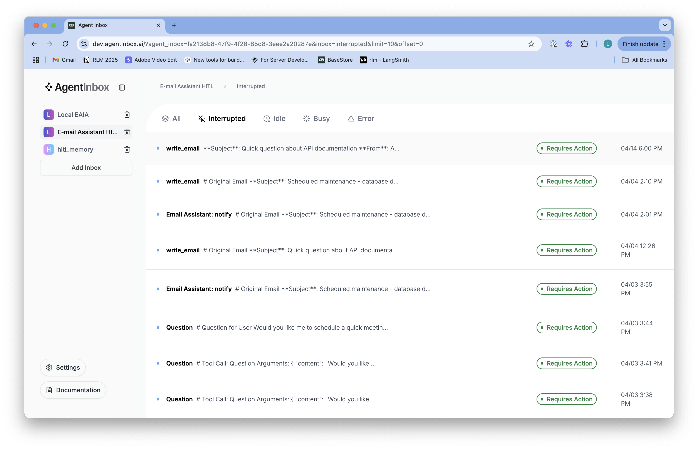

# Agents From Scratch 

AI agents promise to transform how we work, but there's often a gap between hype and reality: to act on our behalf, agents need to learn and remember our preferences. The repo is a guide to building agents from scratch, building from simple principles to self-improving and personalized agents that use LangChain, LangGraph, and LangSmith. 

We're going to build an agent that can act an an e-mail assistant, because this is often a tedious task that could benefit from an AI assistant, but it requires a high level of personalization (e.g., what to respond to, what to ignore, what to schedule a meeting for, and how to respond). The ideas and approaches shown here can be applied to other agents across a wide range of tasks. Here is a map of the components covered:


## Environment Setup 

### Sign up for LangSmith
* Sign up [here](https://docs.smith.langchain.com/) 
* Generate an API key from the Settings page, you'll set this as an environment variable in the next step.

### Prerequisites

1. Create a `.env` file in the root directory with the following that mirrors the `.env.example` file:

```shell
LANGSMITH_API_KEY=your_langsmith_api_key
LANGSMITH_TRACING=true
LANGSMITH_PROJECT="interrupt-workshop"
OPENAI_API_KEY=your_openai_api_key
```

Alternatively, you can also set the environment variables in your terminal:
```shell
export LANGSMITH_API_KEY=your_langsmith_api_key
export LANGSMITH_TRACING=true
export OPENAI_API_KEY=your_openai_api_key
```

2. Create a virtual environment and activate it:
```shell
$ python3 -m venv .venv
$ source .venv/bin/activate
# Ensure you have a recent version of pip (required for editable installs with pyproject.toml)
$ python3 -m pip install --upgrade pip
# Install the package in editable mode
$ pip install -e .
```

## Structure 

The repo is organized into the 4 sections, with a notebook for each and accompanying code in the `src/email_assistant` directory.

### Building an agent 
* Notebook: `notebooks/agent.ipynb`
* `src/email_assistant/email_assistant.py`


In this section, we review the philosophy of building agents, thinking about which parts we can encode as a [fixed workflow](https://langchain-ai.github.io/langgraph/tutorials/workflows/) and which need to be an agent. We compare a tool-calling agent to an agentic workflow, which has a dedicated router to handle the email triage step and allows the agent to focus on the email response. We introduce LangGraph Platform, which can be used to run both of them locally:
```shell
# Install uv package manager
curl -LsSf https://astral.sh/uv/install.sh | sh
uvx --refresh --from "langgraph-cli[inmem]" --with-editable . --python 3.11 langgraph dev
```


### Evaluation 
* Notebook: `notebooks/evaluation.ipynb`
* `eval` and `tests` directories


We introduce a collection of sample emails with ground truth classifications, responses, and expected tool calls defined in `eval/email_dataset.py`. We then use this dataset to test the two assistants above using both Pytest and LangSmith `evaluate` API. The `tests/run_all_tests.py` script can be used to run Pytest on all examples for each assistant in this repo.

```bash
# Run with rich output display
python -m tests.run_all_tests --rich-output
```


In additon, the `evaluate_triage.py` script will run the triage evaluation using the LangSmith `evaluate` API and log the results to LangSmith:

```bash
python -m eval.evaluate_triage
```

### Human-in-the-loop 
* Notebook: `notebooks/hitl.ipynb`
* `src/email_assistant/email_assistant_hitl.py`


What if we want the ability to review and correct the assistant's decisions? In this section, we show how to add a human-in-the-loop (HITL) to the assistant. For this, we use [Agent Inbox](https://github.com/langchain-ai/agent-inbox) to review and correct the assistant's decisions.




### Memory & Learning Through Feedback 
* Notebook: `notebooks/memory.ipynb`
* `src/email_assistant/email_assistant_hitl_memory.py`

  

Our email assistant becomes more powerful when we add memory capabilities, allowing it to learn from user feedback and adapt to preferences over time. The memory-enabled assistant (`email_assistant_hitl_memory.py`) uses [LangMem](https://langchain-ai.github.io/langmem/) to manage memories seamlessly with [LangGraph Store](https://langchain-ai.github.io/langgraph/concepts/memory/#long-term-memory). Over time, you can see memories accumulate in the `Memory` store when viewing in LangGraph Studio.

### Deployment 

We've built up to a system that can learn our preferences over time. The graph already can be run with LangGraph Platform locally using the `langgraph dev` command and deployed to the LangGraph Platform hosted service.

## Tools and Integrations

The email assistant uses a modular tools architecture that allows for different implementations and integrations to be easily swapped. This is structured in the `src/email_assistant/tools` directory:

- **Default Tools**: By default, the assistant uses mock email and calendar tools for testing and development. These are located in `src/email_assistant/tools/default/`.

- **Gmail Integration**: For connecting to real email and calendar services, the assistant can use Gmail API integration tools in `src/email_assistant/tools/gmail/`. See the [Gmail Tools README](src/email_assistant/tools/gmail/README.md) for setup instructions.

- **Custom Integrations**: The modular architecture makes it easy to add new tool integrations by following the same pattern as the existing tool packages.

To use a specific set of tools in your agent:

```python
# For default tools only
tools = get_tools()

# For including Gmail tools
tools = get_tools(include_gmail=True)

# For a specific subset of tools
tools = get_tools(tool_names=["write_email", "triage_email", "fetch_emails_tool"])
```

For a complete example of using Gmail tools, see `src/email_assistant/gmail_assistant.py`.

### Agent Inbox

When using human-in-the-loop capabilities, you can view and interact with the agent at:
https://dev.agentinbox.ai/
