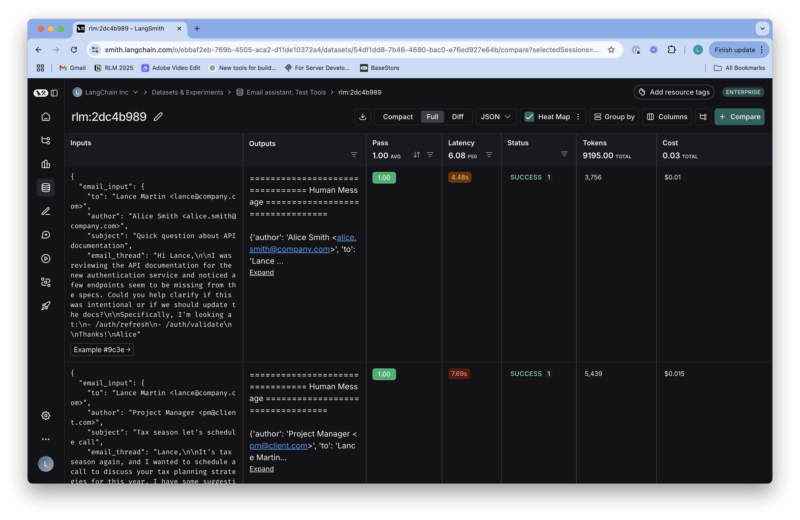
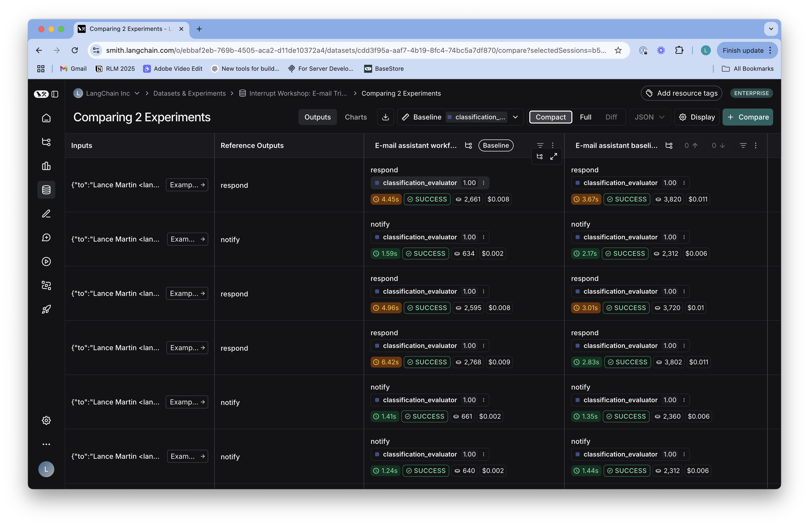

# Evaluating Agents

We have two implementations of our email assistant:

* `src/email_assistant/baseline_agent.py` 
* `src/email_assistant/email_assistant.py`

How can we compare them? [LangSmith](https://docs.smith.langchain.com/) offers two primary ways to test agents. 


## Test Approaches 

### Pytest

[Pytest](https://docs.pytest.org/en/stable/) is well known to many developers. It is a powerful tool for writing tests and is well integrated with the Python ecosystem. LangSmith integrates with pytest to allow you to write tests that we can run on each assistant.

### LangSmith Datasets 

You can also create a dataset [in LangSmith](https://docs.smith.langchain.com/evaluation) and run each assistant against the dataset using the LangSmith evaluate API. TODO: Add just pro/con comparing the two approaches. 

## Test Cases

Testing starts with defining the test cases. We'll use the following:

1. **Input Emails**: A collection of diverse email examples
2. **Ground Truth Classifications**: `Respond`, `Notify`, `Ignore`
3. **Expected Tool Calls**: Tools called for each email that requires a response
4. **Response Criteria**: What makes a good response for emails requiring replies

You can see the test cases in `eval/email_dataset.py`.

## Pytest Example

Here's a simple example using Pytest. 

```python
%cd ..
%load_ext autoreload
%autoreload 2
```

We will test whether the `baseline_agent` makes the appropriate tool calls.

```python
import pytest
from eval.email_dataset import email_inputs, expected_tool_calls
from email_assistant.utils import format_messages_string
from email_assistant.baseline_agent import overall_workflow
from email_assistant.utils import extract_tool_calls

from langsmith import testing as t

@pytest.mark.langsmith
@pytest.mark.parametrize(
    "email_input, expected_calls",
    [   # Pick some examples with e-mail reply expected
        (email_inputs[0],expected_tool_calls[0]),
        (email_inputs[3],expected_tool_calls[3]),
    ],
)
def test_email_dataset_tool_calls(email_input, expected_calls):
    """Test if email processing contains expected tool calls."""
    
    # Set up the assistant
    email_assistant = overall_workflow.compile()
    
    # Run the baseline agent
    messages = [{"role": "user", "content": str(email_input)}]
    result = email_assistant.invoke({"messages": messages})
            
    # Extract tool calls from messages list
    extracted_tool_calls = extract_tool_calls(result['messages'])
            
    # Check if all expected tool calls are in the extracted ones
    missing_calls = [call for call in expected_calls if call.lower() not in extracted_tool_calls]
    
    t.log_outputs({
                "missing_calls": missing_calls,
                "extracted_tool_calls": extracted_tool_calls,
                "response": format_messages_string(result['messages'])
            })

    # Test passes if no expected calls are missing
    assert len(missing_calls) == 0
```

You'll notice a few things:

First, to [run with Pytest and log test results to LangSmith](https://docs.smith.langchain.com/evaluation/how_to_guides/pytest), we only need to add the `@pytest.mark.langsmith ` decorator to our function and place it in a file, as you see in `notebooks/test_tools.py`. 

Second, we can pass dataset examples to the test function as shown [here](https://docs.smith.langchain.com/evaluation/how_to_guides/pytest#parametrize-with-pytestmarkparametrize) via `@pytest.mark.parametrize`. 

We can run the test from the command line as shown below. We can view the results in the LangSmith UI. The `assert len(missing_calls) == 0` is logged to the `Pass` column in LangSmith. The `log_outputs` are passed to the `Outputs` column and function arguments are passed to the `Inputs` column. From  the project root, run:

```
! LANGSMITH_TEST_SUITE='Email assistant: Test Tools'  pytest notebooks/test_tools.py
```

Each input passed in `@pytest.mark.parametrize(` is a separate row logged to the `LANGSMITH_TEST_SUITE` project name in LangSmith, which is found under `Datasets & Experiments`.



## LangSmith Datasets 

### Dataset Definition 

In addition to the Pytest approach, we can also [create a dataset in LangSmith](https://docs.smith.langchain.com/evaluation/how_to_guides/manage_datasets_programmatically#create-a-dataset) with the SDK. This creates a dataset with the test cases in the `eval/email_dataset.py` file.

```python
from langsmith import Client
import matplotlib.pyplot as plt

from eval.email_dataset import examples_triage
from email_assistant.email_assistant import email_assistant
from email_assistant.baseline_agent import email_assistant as baseline_agent

# Initialize LangSmith client
client = Client()

# Dataset name
dataset_name = "Interrupt Workshop: E-mail Triage Dataset"

# Create dataset if it doesn't exist
if not client.has_dataset(dataset_name=dataset_name):
    dataset = client.create_dataset(
        dataset_name=dataset_name, 
        description="A dataset of e-mails and their triage decisions."
    )
    # Add examples to the dataset
    client.create_examples(dataset_id=dataset.id, examples=examples_triage)
```

### Run Agents 

The dataset has the following structure, with an e-mail input and a ground truth classification for the e-mail as output.

```python
examples_triage = [
  {
      "inputs": {"email_input": email_input_1},
      "outputs": {"classification": triage_output_1},
  }, ...
]
```

We define functions that take dataset inputs and pass them to each agent we want to evaluate. The function just takes the `inputs` dict from the dataset and passes it to the agent. It returns a dict with the agent's output.

```python
def target_email_assistant(inputs: dict) -> dict:
    """Process an email through the workflow-based email assistant."""
    response = email_assistant.invoke({"email_input": inputs["email_input"]})
    return {"classification_decision": response['classification_decision']}

def target_email_assistant_baseline(inputs: dict) -> dict:
    """Process an email through the baseline email assistant."""
    # Format email for the baseline agent
    email_content = inputs["email_input"]
    formatted_content = f"""
From: {email_content.get('author', 'Unknown')}
To: {email_content.get('to', 'Unknown')}
Subject: {email_content.get('subject', 'No Subject')}

{email_content.get('email_thread', '')}
"""
    messages = [{"role": "user", "content": f"Please triage this email: {formatted_content}"}]
    response = baseline_agent.invoke({"messages": messages})
    return {"classification_decision": response['classification_decision']}
```

The LangSmith [evaluate API](https://docs.smith.langchain.com/evaluation) passes the `inputs` dict to this function. 

### Evaluator Function 

We also create an evaluator function. What do we want to evaluate? We have reference outputs in our dataset and agent outputs defined in the functions above.

* Reference outputs: `"outputs": {"classification": triage_output_1} ...`
* Agent outputs: `"outputs": {"classification_decision": agent_output_1} ...`

We want to evaluate if the agent's output matches the reference output. So we simply need a an evaluator function that compares the two, where `outputs` is the agent's output and `reference_outputs` is the reference output from the dataset.

```python
def classification_evaluator(outputs: dict, reference_outputs: dict) -> bool:
    """Check if the answer exactly matches the expected answer."""
    return outputs["classification_decision"].lower() == reference_outputs["classification"].lower()
```

### Running Evaluation

Now, the question is: how are these things hooked together? The evaluate API takes care of it for us. It passes the `inputs` dict from our dataset the target function. It passes the `outputs` dict from our dataset to the evaluator function. And it passes the output of our agent to the evaluator function.

```python
experiment_results_baseline = client.evaluate(
    # Run agent  
    target_email_assistant_baseline,
    # Dataset name  
    data=dataset_name,
    # Evaluator
    evaluators=[classification_evaluator],
    # Name of the experiment
    experiment_prefix="E-mail assistant baseline", 
    # Number of concurrent evaluations
    max_concurrency=2, 
)

experiment_results_workflow = client.evaluate(
    # Run agent 
    target_email_assistant,
    # Dataset name   
    data=dataset_name,
    # Evaluator
    evaluators=[classification_evaluator],
    # Name of the experiment
    experiment_prefix="E-mail assistant workflow", 
    # Number of concurrent evaluations
    max_concurrency=2, 
)
```

We can view the results from both experiments in the LangSmith UI.



### Getting Results

We can also get the results of the evaluation, which are returned as `EvaluationResult` objects and can be converted to pandas dataframes. This is great if we want to create our own visualizations to compare the performance of the two agents:

```python
# Convert evaluation results to pandas dataframes
df_baseline = experiment_results_baseline.to_pandas()
df_workflow = experiment_results_workflow.to_pandas()

# Calculate mean scores (values are on a 0-1 scale)
baseline_score = df_baseline[f'feedback.classification_evaluator'].mean()
workflow_score = df_workflow[f'feedback.classification_evaluator'].mean()

# Create a bar plot comparing the two models
plt.figure(figsize=(10, 6))
models = ['Tool Calling Agent', 'Agentic Workflow']
scores = [baseline_score, workflow_score]

# Create and save a bar chart
plt.bar(models, scores, color=['#5DA5DA', '#FAA43A'], width=0.5)
plt.xlabel('Agent Type')
plt.ylabel('Average Score')
plt.title('Email Triage Performance Comparison - Classification Score')
plt.ylim(0, 1.1)
plt.grid(axis='y', linestyle='--', alpha=0.7)
```

